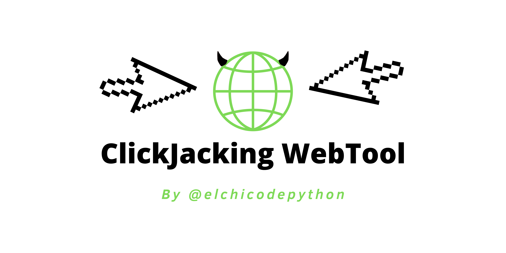

# ClickJacking WebTool

Dynamic clickjacking proof-of-concept. This tool allows you to create urls that
cause a user's browser to make a GET request to a website's endpoint
before being redirected to the final site.

An attacker could, by means of this URL, make the victim perform an action in
his session without knowing it in case the website where the user makes the GET
request has an authentication through cookies.

Online Demo: https://elchicodepython.github.io/clickjacking-webtool/

## Donations

If this tool is useful to you, please consider making a donation to support my
work.

Donations allow me to continue developing open source software.
I wish some day I could focus only on creating quality open source with a
strong community supporting my projects.

You can support me on https://ko-fi.com/elchicodepython.

Thank you so much.

